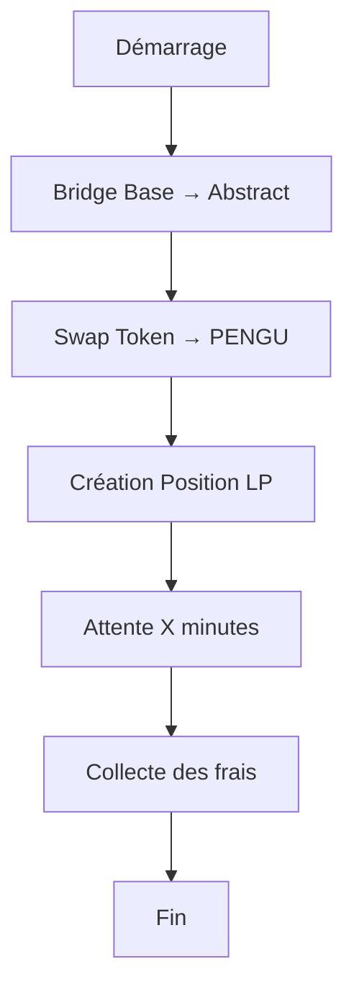

# 🤖 Documentation Complète - Bot BSL.PENGU

## 📋 Table des matières
1. [Vue d'ensemble](#vue-densemble)
2. [Architecture du bot](#architecture-du-bot)
3. [Fonctionnalités implémentées](#fonctionnalités-implémentées)
4. [Commandes CLI](#commandes-cli)
5. [Mode Direct (Nouveau)](#mode-direct-nouveau)
6. [Configuration](#configuration)
7. [Dépannage](#dépannage)
8. [Exemples d'utilisation](#exemples-dutilisation)

---

## 🎯 Vue d'ensemble

Le bot BSL.PENGU est un orchestrateur automatisé pour la gestion de liquidité sur les DEX Uniswap v3. Il permet de :
- **Bridger** des tokens entre Base et Abstract
- **Swapper** des tokens sur Abstract
- **Créer des positions LP** concentrées
- **Collecter automatiquement** les frais générés

### 🏗️ Architecture technique
- **TypeScript** avec compilation vers JavaScript
- **Ethers.js v6** pour les interactions blockchain
- **Commander.js** pour l'interface CLI
- **Winston** pour le logging structuré
- **Vitest** pour les tests

---

## 🏛️ Architecture du bot

### 📁 Structure des fichiers
```
src/
├── cli/           # Interface en ligne de commande
├── orchestrator/  # Orchestrateur principal
├── bridge/        # Gestion des bridges (Li.Fi)
├── dex/           # Interactions DEX (Uniswap v3)
├── lp/            # Gestion des positions LP
├── services/      # Services utilitaires
├── core/          # Fonctionnalités de base
└── config/        # Configuration et constantes
```

### 🔄 Flow principal


---

## ⚡ Fonctionnalités implémentées

### 1. 🌉 **Bridge (Li.Fi)**
- **Support** : Base ↔ Abstract
- **Tokens** : ETH, USDC
- **Fonctionnalités** :
  - Calcul automatique des routes optimales
  - Gestion des slippages
  - Retry automatique en cas d'échec
  - Logging détaillé des transactions

### 2. 🔄 **Swap (Uniswap v3)**
- **Paires supportées** : PENGU/ETH, PENGU/USDC
- **Fonctionnalités** :
  - Découverte automatique des pools
  - Calcul des prix optimaux
  - Gestion des frais de trading
  - Support des différents tiers de frais (0.05%, 0.3%, 1%)

### 3. 🏊 **Positions LP (Uniswap v3)**
- **Fonctionnalités** :
  - Création de positions concentrées
  - Gestion des ranges personnalisables
  - Calcul automatique des ticks
  - Gestion des montants minimaux
  - Collecte automatique des frais

### 4. 🎛️ **Orchestrateur**
- **Gestion d'état** : Persistance des étapes
- **Retry logic** : Tentatives automatiques
- **Logging** : Traçabilité complète
- **Gestion des erreurs** : Récupération gracieuse

---

## 💻 Commandes CLI

### 🚀 **Mode Complet (Bridge → Swap → LP → Collect)**
```bash
node dist/cli/run.js full \
  --fresh \
  --bridgeAmount 1 \
  --bridgeToken USDC \
  --swapAmount 0.3 \
  --swapPair PENGU/USDC \
  --lpRange 5 \
  --collectAfter 120 \
  --dry-run false
```

**Paramètres :**
- `--fresh` : Démarrer avec un état propre
- `--bridgeAmount` : Montant à bridger
- `--bridgeToken` : Token à bridger (ETH/USDC)
- `--swapAmount` : Montant à swapper
- `--swapPair` : Paire de swap (PENGU/ETH|PENGU/USDC)
- `--lpRange` : Range LP en pourcentage
- `--collectAfter` : Minutes avant collecte des frais
- `--dry-run` : Mode simulation

### 🎯 **Mode Direct (LP → Collect sans bridge)**
```bash
node dist/cli/run.js direct \
  --pair PENGU/USDC \
  --amount0 0.3 \
  --amount1 0.5 \
  --range 5 \
  --collectAfter 120 \
  --dry-run false
```

**Paramètres :**
- `--pair` : Paire de tokens (PENGU/ETH|PENGU/USDC)
- `--amount0` : Montant du token0
- `--amount1` : Montant du token1
- `--range` : Range LP en pourcentage
- `--collectAfter` : Minutes avant collecte des frais
- `--dry-run` : Mode simulation
- `--fresh` : État propre

### 🔧 **Commandes individuelles**

#### **Bridge seul :**
```bash
node dist/cli/run.js bridge execute \
  --privateKey 0x... \
  --toToken USDC \
  --amount 1
```

#### **LP direct :**
```bash
node dist/cli/run.js lp add \
  --pair PENGU/USDC \
  --amount0 0.3 \
  --amount1 0.5 \
  --range 5
```

#### **Collecte des frais :**
```bash
node dist/cli/run.js lp collect \
  --tokenId 12345
```

#### **Statut :**
```bash
node dist/cli/run.js status
```

#### **Reset :**
```bash
node dist/cli/run.js reset
```

---

## 🆕 Mode Direct (Nouveau)

### 🎯 **Objectif**
Permettre la création de positions LP directement avec les fonds disponibles sur Abstract, sans passer par un bridge.

### ✅ **Fonctionnalités implémentées**
- **Détection automatique des pools** : Trouve les pools disponibles
- **Vérification des balances** : Lit les soldes des tokens
- **Calcul des montants** : Ajuste selon l'ordre du pool (token0/token1)
- **Gestion des décimales** : Conversion correcte USDC (6) et PENGU (18)
- **Mode dry-run** : Simulation parfaite
- **Flow complet** : LP → Attente → Collecte

### ❌ **Problèmes identifiés**
1. **Création de position LP** : Erreur en mode réel
2. **Gestion des erreurs** : Messages peu clairs
3. **Approbations** : Pas de vérification des autorisations

### 🔧 **Code implémenté**

#### **Types TypeScript :**
```typescript
export interface OrchestratorDirectParams {
  privateKey: string;
  pair: 'PENGU/ETH' | 'PENGU/USDC';
  amount0: string;
  amount1: string;
  rangePercent: number;
  collectAfterMinutes: number;
  dryRun?: boolean;
  autoGasTopUp?: boolean;
  minNativeOnDest?: string;
  gasTopUpTarget?: string;
}
```

#### **Nouvelles étapes :**
```typescript
export enum OrchestratorStep {
  // ... étapes existantes
  DIRECT_LP_PENDING = 'direct_lp_pending',
  DIRECT_LP_DONE = 'direct_lp_done',
  DIRECT_COLLECT_PENDING = 'direct_collect_pending',
  DIRECT_COLLECT_DONE = 'direct_collect_done',
}
```

#### **Méthode runDirect :**
```typescript
async runDirect(params: OrchestratorDirectParams): Promise<OrchestratorResult> {
  // 1. Création du contexte
  // 2. Vérification des connexions RPC
  // 3. Exécution de l'étape LP directe
  // 4. Attente et collecte des frais
  // 5. Retour des métriques
}
```

---

## ⚙️ Configuration

### 🔑 **Variables d'environnement**
```bash
# Clés privées
PRIVATE_KEY=0x...

# RPC
BASE_RPC_URL=https://...
ABSTRACT_RPC_URL=https://...

# Tokens (Abstract)
PENGU_ADDRESS_ABS=0x9eBe3A824Ca958e4b3Da772D2065518F009CBa62
WETH_ADDRESS_ABS=0x3439153EB7AF838Ad19d56E1571FBD09333C2809
USDC_ADDRESS_ABS=0x84A71ccD554Cc1b02749b35d22F684CC8ec987e1

# Li.Fi
LIFI_API_KEY=your_api_key
```

### 📊 **Constantes**
```typescript
export const CONSTANTS = {
  CHAIN_IDS: {
    BASE: 8453,
    ABSTRACT: 2741,
  },
  TOKENS: {
    PENGU: "0x9eBe3A824Ca958e4b3Da772D2065518F009CBa62",
    WETH: "0x3439153EB7AF838Ad19d56E1571FBD09333C2809",
    USDC: "0x84A71ccD554Cc1b02749b35d22F684CC8ec987e1",
  },
  UNIV3: {
    FEE_TIERS: [500, 3000, 10000],
  },
};
```

---

## 🚨 Dépannage

### ❌ **Erreurs communes**

#### **1. "execution reverted"**
- **Cause** : Transaction échoue au niveau du smart contract
- **Solutions** :
  - Vérifier les balances disponibles
  - Augmenter le range LP
  - Utiliser `--fresh` pour un état propre

#### **2. "unsupported addressable value"**
- **Cause** : Adresses de tokens incorrectes
- **Solutions** :
  - Vérifier les constantes dans `src/config/env.ts`
  - S'assurer que les adresses correspondent au réseau

#### **3. "No pools found"**
- **Cause** : Aucun pool disponible pour la paire
- **Solutions** :
  - Vérifier que les tokens existent sur Abstract
  - S'assurer que les pools sont créés

### 🔧 **Commandes de diagnostic**
```bash
# Vérifier le statut
node dist/cli/run.js status

# Reset l'état
node dist/cli/run.js reset

# Test en mode dry-run
node dist/cli/run.js direct --pair PENGU/USDC --amount0 0.1 --amount1 0.1 --range 10 --dry-run true
```

---

## 📚 Exemples d'utilisation

### 🎯 **Scénario 1 : Flow complet**
```bash
# 1. Bridge 1 USDC depuis Base vers Abstract
# 2. Swap 0.3 USDC → PENGU
# 3. Créer position LP PENGU/USDC (±5%)
# 4. Attendre 120 minutes
# 5. Collecter les frais automatiquement

node dist/cli/run.js full \
  --fresh \
  --bridgeAmount 1 \
  --bridgeToken USDC \
  --swapAmount 0.3 \
  --swapPair PENGU/USDC \
  --lpRange 5 \
  --collectAfter 120 \
  --dry-run false
```

### 🎯 **Scénario 2 : Mode direct**
```bash
# 1. Créer position LP directement avec les fonds disponibles
# 2. Attendre 120 minutes
# 3. Collecter les frais automatiquement

node dist/cli/run.js direct \
  --pair PENGU/USDC \
  --amount0 0.3 \
  --amount1 0.5 \
  --range 10 \
  --collectAfter 120 \
  --dry-run false
```

### 🎯 **Scénario 3 : Collecte seule**
```bash
# Collecter les frais d'une position existante

node dist/cli/run.js lp collect --tokenId 12345
```

---

## 📈 Métriques et monitoring

### 📊 **Logs structurés**
Le bot utilise Winston pour un logging structuré avec :
- **Niveaux** : INFO, WARN, ERROR
- **Contexte** : wallet, step, duration, etc.
- **Format** : JSON pour faciliter l'analyse

### 🎯 **Métriques collectées**
- **Durée totale** d'exécution
- **Frais collectés** par token
- **Étapes réussies/échouées**
- **Tentatives de retry**

---

## 🚀 Prochaines améliorations

### 🔧 **Corrections prioritaires**
1. **Fixer la création de position LP** en mode direct
2. **Améliorer la gestion des erreurs** avec des messages clairs
3. **Ajouter la vérification des approbations** de tokens

### ✨ **Nouvelles fonctionnalités**
1. **Support de nouvelles paires** de tokens
2. **Gestion des positions multiples**
3. **Interface web** pour le monitoring
4. **Alertes** en cas de problème

---

## 📞 Support

### 🔍 **Debugging**
- Utilisez `--dry-run true` pour tester sans transaction
- Vérifiez les logs pour identifier les problèmes
- Utilisez `--fresh` pour un état propre

### 📝 **Logs**
Les logs sont disponibles dans la console avec un format structuré :
```json
{
  "level": 30,
  "time": 1758463245318,
  "wallet": "0x6D9dBe056A00b2CD3156dA90f8589E504F4a33D4",
  "message": "Démarrage de l'orchestrateur"
}
```

---

**🎉 Le bot BSL.PENGU est maintenant prêt à automatiser vos stratégies de liquidité !**
